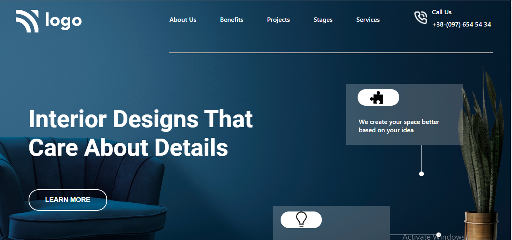

# Mukul Basu

## Project 10

## Important Things learnt 
1. PNG editing and resizing
2. Opacity

## Honest Time to finish this project

Took around **3.5 hrs**
It was a long drawn battle with a lot of elements to be handled. Specially with images, designs and borders.

## Focus Learning
- how to handle opacity
- how to utilise float option.
- how to right an effective and crisp HTML DOM.

## Live link

[Project Link](https://google.com "Netlify")

